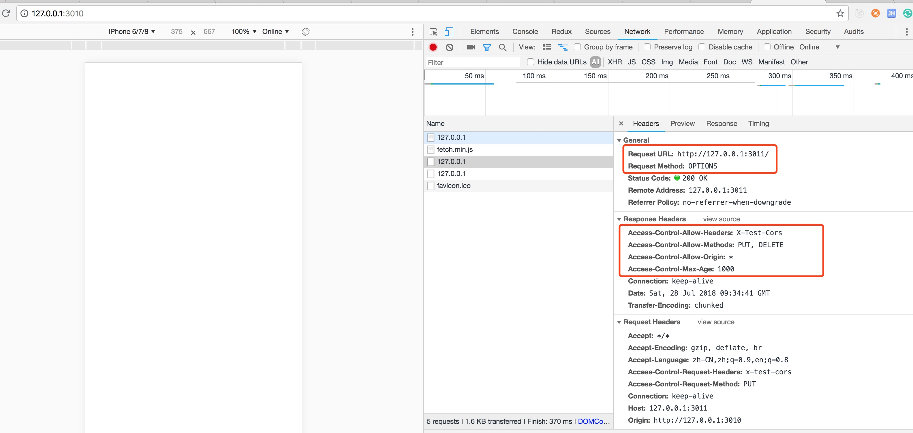
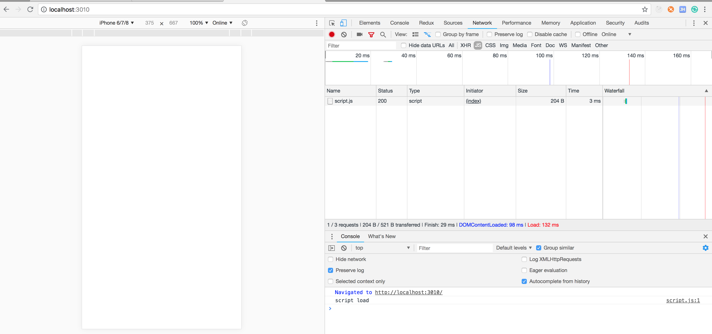
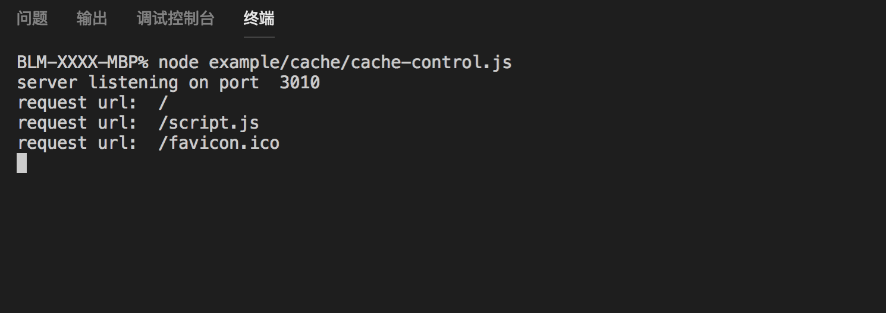
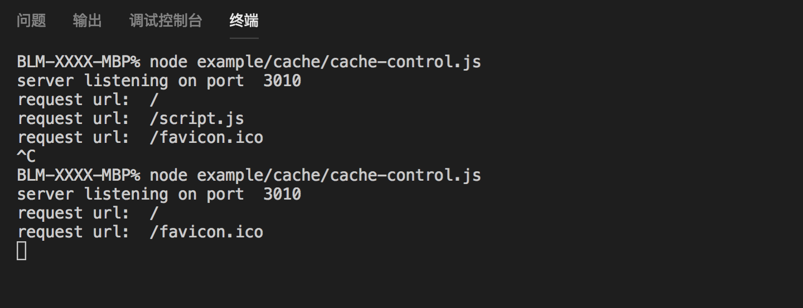
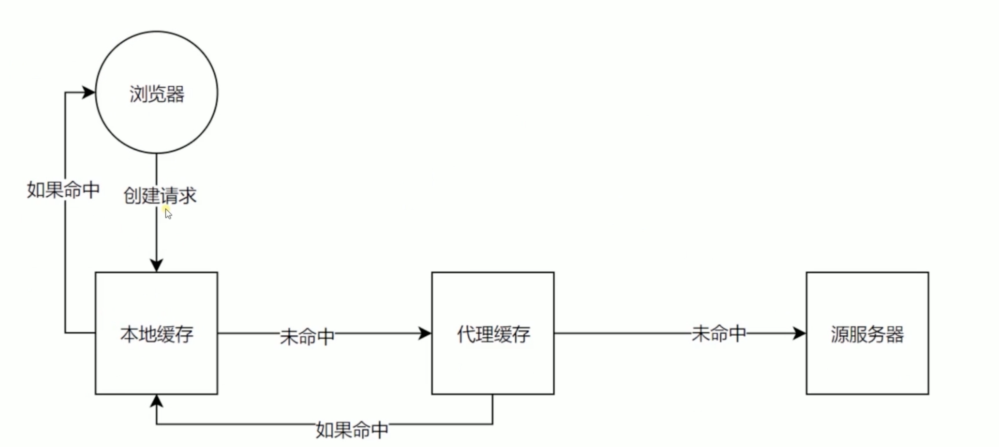
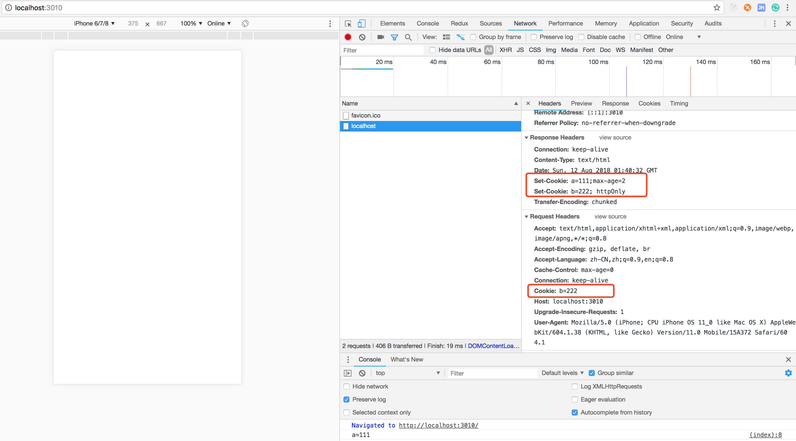

- [HTTP 简介](#http-%E7%AE%80%E4%BB%8B)

  - [HTTP 工作原理](#http-%E5%B7%A5%E4%BD%9C%E5%8E%9F%E7%90%86)
    - [http 三点注意事项](#http-%E4%B8%89%E7%82%B9%E6%B3%A8%E6%84%8F%E4%BA%8B%E9%A1%B9)
      - [注释](#%E6%B3%A8%E9%87%8A)
  - [HTTP 消息结构](#http-%E6%B6%88%E6%81%AF%E7%BB%93%E6%9E%84)
  - [客户端请求信息](#%E5%AE%A2%E6%88%B7%E7%AB%AF%E8%AF%B7%E6%B1%82%E4%BF%A1%E6%81%AF)
  - [服务器响应消息](#%E6%9C%8D%E5%8A%A1%E5%99%A8%E5%93%8D%E5%BA%94%E6%B6%88%E6%81%AF)
  - [实例](#%E5%AE%9E%E4%BE%8B)
  - [HTTP请求方法](#http%E8%AF%B7%E6%B1%82%E6%96%B9%E6%B3%95)
  - [HTTP 响应头信息](#http-%E5%93%8D%E5%BA%94%E5%A4%B4%E4%BF%A1%E6%81%AF)
  - [HTTP状态码](#http%E7%8A%B6%E6%80%81%E7%A0%81)
  - [HTTP Content-Type](#http-content-type)
- [Socket hang up 是什么？什么情况下会发生？](#socket-hang-up-%E6%98%AF%E4%BB%80%E4%B9%88%E4%BB%80%E4%B9%88%E6%83%85%E5%86%B5%E4%B8%8B%E4%BC%9A%E5%8F%91%E7%94%9F)
  - [什么是 Socket hang up](#%E4%BB%80%E4%B9%88%E6%98%AF-socket-hang-up)
  - [复现 Socket hang up](#%E5%A4%8D%E7%8E%B0-socket-hang-up)
  - [Socket hang up 解决](#socket-hang-up-%E8%A7%A3%E5%86%B3)
  - [ECONNRESET VS ETIMEDOUT](#econnreset-vs-etimedout)
- [DNS 域名解析过程？](#dns-%E5%9F%9F%E5%90%8D%E8%A7%A3%E6%9E%90%E8%BF%87%E7%A8%8B)
    - [1. 浏览器 DNS 缓存](#1-%E6%B5%8F%E8%A7%88%E5%99%A8-dns-%E7%BC%93%E5%AD%98)
    - [2. 系统（OS）缓存](#2-%E7%B3%BB%E7%BB%9Fos%E7%BC%93%E5%AD%98)
    - [3. 路由器缓存](#3-%E8%B7%AF%E7%94%B1%E5%99%A8%E7%BC%93%E5%AD%98)
    - [4. ISP DNS 缓存](#4-isp-dns-%E7%BC%93%E5%AD%98)
  - [Reference](#reference)
- [HTTP协议原理分享](#http%E5%8D%8F%E8%AE%AE%E5%8E%9F%E7%90%86%E5%88%86%E4%BA%AB)
  - [5层网络模型介绍](#5%E5%B1%82%E7%BD%91%E7%BB%9C%E6%A8%A1%E5%9E%8B%E4%BB%8B%E7%BB%8D)
      - [应用层](#%E5%BA%94%E7%94%A8%E5%B1%82)
      - [传输层](#%E4%BC%A0%E8%BE%93%E5%B1%82)
      - [网络层](#%E7%BD%91%E7%BB%9C%E5%B1%82)
      - [数据链路层](#%E6%95%B0%E6%8D%AE%E9%93%BE%E8%B7%AF%E5%B1%82)
      - [物理层](#%E7%89%A9%E7%90%86%E5%B1%82)
  - [http协议发展历史](#http%E5%8D%8F%E8%AE%AE%E5%8F%91%E5%B1%95%E5%8E%86%E5%8F%B2)
      - [阶段一](#%E9%98%B6%E6%AE%B5%E4%B8%80)
      - [阶段二](#%E9%98%B6%E6%AE%B5%E4%BA%8C)
      - [阶段三](#%E9%98%B6%E6%AE%B5%E4%B8%89)
      - [阶段四](#%E9%98%B6%E6%AE%B5%E5%9B%9B)
  - [http三次握手](#http%E4%B8%89%E6%AC%A1%E6%8F%A1%E6%89%8B)
      - [客户端与服务器端的一次请求](#%E5%AE%A2%E6%88%B7%E7%AB%AF%E4%B8%8E%E6%9C%8D%E5%8A%A1%E5%99%A8%E7%AB%AF%E7%9A%84%E4%B8%80%E6%AC%A1%E8%AF%B7%E6%B1%82)
      - [三次握手时序图](#%E4%B8%89%E6%AC%A1%E6%8F%A1%E6%89%8B%E6%97%B6%E5%BA%8F%E5%9B%BE)
      - [三次握手数据包详细内容分析](#%E4%B8%89%E6%AC%A1%E6%8F%A1%E6%89%8B%E6%95%B0%E6%8D%AE%E5%8C%85%E8%AF%A6%E7%BB%86%E5%86%85%E5%AE%B9%E5%88%86%E6%9E%90)
      - [总结](#%E6%80%BB%E7%BB%93)
  - [URI/URL/URN](#uriurlurn)
      - [URI](#uri)
      - [URL](#url)
      - [URN](#urn)
  - [跨域cors](#%E8%B7%A8%E5%9F%9Fcors)
      - [示例](#%E7%A4%BA%E4%BE%8B)
      - [基于http协议层面的几种解决办法](#%E5%9F%BA%E4%BA%8Ehttp%E5%8D%8F%E8%AE%AE%E5%B1%82%E9%9D%A2%E7%9A%84%E5%87%A0%E7%A7%8D%E8%A7%A3%E5%86%B3%E5%8A%9E%E6%B3%95)
      - [CORS预请求](#cors%E9%A2%84%E8%AF%B7%E6%B1%82)
  - [缓存头Cache-Control的含义和使用](#%E7%BC%93%E5%AD%98%E5%A4%B4cache-control%E7%9A%84%E5%90%AB%E4%B9%89%E5%92%8C%E4%BD%BF%E7%94%A8)
      - [可缓存性](#%E5%8F%AF%E7%BC%93%E5%AD%98%E6%80%A7)
      - [到期](#%E5%88%B0%E6%9C%9F)
      - [重新验证](#%E9%87%8D%E6%96%B0%E9%AA%8C%E8%AF%81)
      - [其它](#%E5%85%B6%E5%AE%83)
      - [缓存cache-control示例](#%E7%BC%93%E5%AD%98cache-control%E7%A4%BA%E4%BE%8B)
      - [资源验证](#%E8%B5%84%E6%BA%90%E9%AA%8C%E8%AF%81)
        - [验证头](#%E9%AA%8C%E8%AF%81%E5%A4%B4)
  - [cookie](#cookie)
      - [cookie属性](#cookie%E5%B1%9E%E6%80%A7)
      - [示例](#%E7%A4%BA%E4%BE%8B-1)
      - [cookie的domain设置](#cookie%E7%9A%84domain%E8%AE%BE%E7%BD%AE)
  - [http长链接](#http%E9%95%BF%E9%93%BE%E6%8E%A5)
      - [http/1.1](#http11)
      - [http/1.1长链接示例](#http11%E9%95%BF%E9%93%BE%E6%8E%A5%E7%A4%BA%E4%BE%8B)
  - [数据协商(内容协商)](#%E6%95%B0%E6%8D%AE%E5%8D%8F%E5%95%86%E5%86%85%E5%AE%B9%E5%8D%8F%E5%95%86)
    - [内容协商的基本原则](#%E5%86%85%E5%AE%B9%E5%8D%8F%E5%95%86%E7%9A%84%E5%9F%BA%E6%9C%AC%E5%8E%9F%E5%88%99)
    - [最佳展现形式](#%E6%9C%80%E4%BD%B3%E5%B1%95%E7%8E%B0%E5%BD%A2%E5%BC%8F)
    - [服务端驱动型内容协商机制](#%E6%9C%8D%E5%8A%A1%E7%AB%AF%E9%A9%B1%E5%8A%A8%E5%9E%8B%E5%86%85%E5%AE%B9%E5%8D%8F%E5%95%86%E6%9C%BA%E5%88%B6)
    - [Accept首部 ( 对应Response Headers中 Content-Type )](#accept%E9%A6%96%E9%83%A8--%E5%AF%B9%E5%BA%94response-headers%E4%B8%AD-content-type-)
    - [Accept-Encoding首部( 对应Response Headers中 Content-Encoding )](#accept-encoding%E9%A6%96%E9%83%A8-%E5%AF%B9%E5%BA%94response-headers%E4%B8%AD-content-encoding-)
    - [Accept-Language首部( 对应Response Headers中 Content-Language )](#accept-language%E9%A6%96%E9%83%A8-%E5%AF%B9%E5%BA%94response-headers%E4%B8%AD-content-language-)
    - [User-Agent首部](#user-agent%E9%A6%96%E9%83%A8)
  - [csp](#csp)
      - [限制方式](#%E9%99%90%E5%88%B6%E6%96%B9%E5%BC%8F)
      - [参考示例](#%E5%8F%82%E8%80%83%E7%A4%BA%E4%BE%8B)
      - [更多的设置方式](#%E6%9B%B4%E5%A4%9A%E7%9A%84%E8%AE%BE%E7%BD%AE%E6%96%B9%E5%BC%8F)
  - [nginx服务配置](#nginx%E6%9C%8D%E5%8A%A1%E9%85%8D%E7%BD%AE)
      - [windows安装可参考以下](#windows%E5%AE%89%E8%A3%85%E5%8F%AF%E5%8F%82%E8%80%83%E4%BB%A5%E4%B8%8B)
      - [Mac安装](#mac%E5%AE%89%E8%A3%85)
      - [修改hosts文件配置本地域名](#%E4%BF%AE%E6%94%B9hosts%E6%96%87%E4%BB%B6%E9%85%8D%E7%BD%AE%E6%9C%AC%E5%9C%B0%E5%9F%9F%E5%90%8D)
      - [nginx配置缓存](#nginx%E9%85%8D%E7%BD%AE%E7%BC%93%E5%AD%98)
      - [nginx部署https服务](#nginx%E9%83%A8%E7%BD%B2https%E6%9C%8D%E5%8A%A1)
        - [生成public key和private key](#%E7%94%9F%E6%88%90public-key%E5%92%8Cprivate-key)
        - [基于上面的nginx-cache.conf文件进行修改](#%E5%9F%BA%E4%BA%8E%E4%B8%8A%E9%9D%A2%E7%9A%84nginx-cacheconf%E6%96%87%E4%BB%B6%E8%BF%9B%E8%A1%8C%E4%BF%AE%E6%94%B9)
        - [http自动跳转https](#http%E8%87%AA%E5%8A%A8%E8%B7%B3%E8%BD%AChttps)
      - [实现http2协议](#%E5%AE%9E%E7%8E%B0http2%E5%8D%8F%E8%AE%AE)

## HTTP 简介

http协议是 hyper text transfer protocol 超文本传输协议的缩写，是由于从万维网 （www:world wide web
）服务器传输超文本到本地浏览器的传送协议。

http是一个基于TCP/IP通信协议来传输数据（html 文件，图片文件，查询结果等）。

## HTTP 工作原理
http协议工作于客户端-服务端架构上。浏览器作为http客户端通过url向http服务端即web服务器发送所有请求。

web服务器有：apache服务器，iis服务器（internet information services），nginx 等。
web服务器根据接收到的请求后，向服务端发送响应信息。
http默认端口号为80，但是你也可以改为8080端口或者其他端口。

### http 三点注意事项

-  http是无连接：无连接的含义是限制每次连接只处理一个情求。服务器处理完客户请求，并收到客户的应答后，即断开连接。采用这种方式可以节省传输时间。
- http是媒体独立的：这意味着，只要客户端和服务器知道如何处理的数据内容，任何类型的数据都可以通过http发送。客户端以及服务器指定使用适合的 MIME-type 内容类型。
- http是无状态的：http协议是无状态协议。无状态是指协议对于事物处理没有记忆能力。缺少状态意味着如果后续处理需要前面的信息，则它必须重传，这样可能导致每次连接传送的数据量增大，另一方面，在服务器不需要先前信息时它的应答就较快。

以下图展示了http协议通信流程：


#### 注释

1. MIME-type 是该资源的媒体类型，MIME-type 不是个人指定的，是经过互联网（IETF）组织协商，以 RFC（是一系列以编号排定的文件，几乎所有的互联网标准都有收录在其中） 的形式作为建议的标准发布在网上的，大多数的 Web 服务器和用户代理都会支持这个规范 (顺便说一句，Email 附件的类型也是通过 MIME-type 指定的)。

   媒体类型通常通过 HTTP 协议，由 Web 服务器告知浏览器的，更准确地说，是通过 Content-Type 来表示的。例如：**Content-Type：text/HTML**。

   通常只有一些卓哉互联网上获得广泛应用的格式才会获得一个 MIME-type，如果是某个客户端自己定义的格式，一般只能以 application/x- 开头。

2. CGI(Common Gateway Interface) 是 HTTP 服务器与你的或其它机器上的程序进行“交谈”的一种工具，其程序须运行在网络服务器上。

   绝大多数的 CGI 程序被用来解释处理来自表单的输入信息，并在服务器产生相应的处理，或将相应的信息反馈给浏览器。CGI 程序使网页具有交互功能。


## HTTP 消息结构

http是基于客户端/服务端（c/s）的结构模型，通过一个可靠的链接来交换信息，是一个无状态的请求/响应协议。

一个http‘’客户端”是一个应用程序（web浏览器或其他任何客户端），通过连接到服务器达到向服务器发送一个或多个http的请求目的。

一个http“服务器”同样是一个应用程序（通常是一个web服务，如apache web服务器或iis服务器或者nginx服务器等），通过接收客户端的请求并向客户端发送http响应数据。

http使用统一资源标识符（uniform resource identifiers, URL）来传输数据和建立连接。

一旦建立连接后，数据消息就通过类似Internet邮件所使用的格式[RFC5322]和多用途Internet邮件扩展（MIME）[RFC2045]来传送。

## 客户端请求信息

客户端发送一个HTTP请求到服务器的请求信息包括以下格式：请求行（request line）、请求头部（header）、空行和请求数据四个部分组成，下图给出了请求报文的一般格式。


## 服务器响应消息

HTTP响应也由四个部分组成，分别是：状态行，消息报头，空行和响应正文。


## 实例

下面实例是一点典型的使用GET来传递数据的实例：

客户端请求：

```
GET /hello.txt HTTP/1.1
User-Agent: curl/7.16.3 libcurl/7.16.3 OpenSSL/0.9.7l zlib/1.2.3
Host: www.example.com
Accept-Language: en, mi
```

服务端响应：

```
HTTP/1.1 200 OK
Date: Mon, 27 Jul 2009 12:28:53 GMT
Server: Apache
Last-Modified: Wed, 22 Jul 2009 19:15:56 GMT
ETag: "34aa387-d-1568eb00"
Accept-Ranges: bytes
Content-Length: 51
Vary: Accept-Encoding
Content-Type: text/plain
```

输出结果：

```
Hello World! My payload includes a trailing CRLF.
```


##  HTTP请求方法

根据 HTTP 标准，HTTP 请求可以使用多种请求方法。

HTTP1.0 定义了三种请求方法：GET，POST 和 HEAD 方法。

HTTP1.1 新增了六种请求方法：OPTIONDS、PUT、PATCH、DELETE、TRACE、CONNECT方法。


| 序号 |  方法   | 描述                                                         |
| :--: | :-----: | ------------------------------------------------------------ |
|  1   |   GET   | 请求指定的页面信息，并返回实体主体。                         |
|  2   |  HEAD   | 类似于GET请求，只不过返回的响应中没有具体的内容，用于获取报头。 |
|  3   |  POST   | 向指定资源提交数据进行处理请求（例如提交表单或者上传文件）。数据被包含在请求体中。POST请求可能会导致新的资源的建立和/或已有资源的修改。 |
|  4   |   PUT   | 从客户端向服务器传送的数据**取代**指定的文档的内容。         |
|  5   | DELETE  | 请求服务器删除指定的页面。                                   |
|  6   | CONNECT | HTTP/1.1协议中预留给能够将连接改成管道方式的代理服务器。     |
|  7   |  TRACE  | 回显服务器收到的请求，主要用于测试或者诊断。                 |
|  8   |  PATCH  | 是对PUT方法的补充，用来对已有资源进行局部更新。              |


## HTTP 响应头信息

HTTP请求头提供了关于请求，响应或者其他发送实体的信息。

在本章节中我们将具体来介绍HTTP响应头的信息。

| 请求头           | 说明                                                         |
| ---------------- | ------------------------------------------------------------ |
| Allow            | 服务器支持那些请求方法（如GET、POST等）。                    |
| Content-Encoding | 文档的编码（Encode）方法。只有在解码之后才可以得到Content-Type头指定的内容类型。利用gzip压缩文档能够显著地减少HTML文档的下载时间。Java的GZIPOutputStream可以很方便地进行gzip压缩，但只有Unix上的Netscape和Windows上的IE 4、IE 5才支持它。因此，Servlet应该通过查看Accept-Encoding头（即request.getHeader("Accept-Encoding")）检查浏览器是否支持gzip，为支持gzip的浏览器返回经gzip压缩的HTML页面，为其他浏览器返回普通页面。 |
| Content-Length   | 表示内容长度。只有当浏览器使用持久HTTP连接时才需要这个数据。如果你想要利用持久连接的优势，可以把输出文档写入 ByteArrayOutputStream，完成后查看其大小，然后把该值放入Content-Length头，最后通过byteArrayStream.writeTo(response.getOutputStream()发送内容。 |
| Content-Type     | 表示后面的文档属于什么MIME类型。Servlet默认为text/plain，但通常需要显式地指定为text/html。由于经常要设置Content-Type，因此HttpServletResponse提供了一个专用的方法setContentType。 |
| Date             | 当前的GMT时间。你可以用setDateHeader来设置这个头以避免转换时间格式的麻烦。 |
| Expires          | 应该在什么时候认定该文档已经过期，从而不再缓存它             |
| Last-Modified    | 文档的最后改动时间。客户可以通过If-Modified-Since请求头提供一个日期，该请求将被视为一个条件GET，只有改动时间迟于指定时间的文档才会返回，否则返回一个304（Not Modified）状态。Last-Modified也可以用setDateHeader方法来设置。 |
| Location         | 表示当前客户应当哪里去提取文档。Location通常不是直接设置的，而是通过HttpServletResponse的sendRedirect方法，该方法同时设置状态代码为302。 |
| Refresh          | 表示浏览器应该在多少时间之后刷新文档，以秒计。除了刷新当前文档之外，你还可以通过setHeader("Refresh", "5; URL=http://host/path")让浏览器读取指定的页面。 注意这种功能通常是通过设置HTML页面HEAD区的＜META HTTP-EQUIV="Refresh" CONTENT="5;URL=http://host/path"＞实现，这是因为，自动刷新或重定向对于那些不能使用CGI或Servlet的HTML编写者十分重要。但是，对于Servlet来说，直接设置Refresh头更加方便。 |
| Server           | 服务器名字。Servlet一般不设置这个值，而是由Web服务器自己设置。 |
| Set-Cookie       | 设置和页面关联的Cookie。Servlet不应使用response.setHeader("Set-Cookie", ...)，而是应使用HttpServletResponse提供的专用方法addCookie。参见下文有关Cookie设置的讨论。 |
| WWW-Authenticate | 客户应该在Authorization头中提供什么类型的授权信息？在包含401（Unauthorized）状态行的应答中这个头是必需的。例如，response.setHeader("WWW-Authenticate", "BASIC realm=＼"executives＼"")。<br/>注意Servlet一般不进行这方面的处理，而是让Web服务器的专门机制来控制受密码保护页面的访问（例如.htaccess）。 |


## HTTP状态码

当浏览者访问一个页面时，浏览者的浏览器会向网页所在的服务器发送请求。当浏览器接收并显示网页前，此网页所在的服务器会返回一个包含HTTP状态码的信息头（server header）用以响应浏览器的请求。

HTTP状态码的英文为HTTP Status Code。

- 200 - 请求成功
- 301 - 资源（网页等）被永久移到其他URL
- 404 - 请求的资源（网页等）不存在
- 500 - 内部服务器错误

HTTP状态码分类

HTTP状态码由三十个十进制数字组成，第一个十进制数字定义了状态码的类型，后两个数字没有分类的作用。HTTP状态码共分为5种类型：

<center>HTTP状态码分类

| 分类 | 描述                                           |
| ---- | ---------------------------------------------- |
| 1**  | 信息，服务器收到请求，需要请求者继续执行操作   |
| 2**  | 成功，操作被成功接收并处理                     |
| 3**  | 重定向，需要进一步的操作以完成请求             |
| 4**  | 客户端错误，请求包含语法错误或无法完成请求     |
| 5**  | 服务端错误，服务器在处理请求的过程中发生了错误 |

<center>HTTP状态码列表

| 状态码 | 状态码英文名称                  | 中文描述符                                                   |
| ------ | ------------------------------- | ------------------------------------------------------------ |
| 100    | Continue                        | 继续。客户端应继续其请求                                     |
| 101    | Switching Protocol              | 切换协议。服务器根据客户端的请求切换协议。只能切换更高级的协议，例如，切换到HTTP的新版本协议 |
|        |                                 |                                                              |
| 200    | OK                              | 请求成功。一般用于GET与POST请求                              |
| 201    | Create                          | 已创建。成功请求并创建了资源                                 |
| 202    | Accepted                        | 已接受。已经接受请求，但未处理完成。                         |
| 203    | Non-Authoritative Information   | 非授权信息。请求成功。但返回的meta信息不在原始的服务器上，而是另一个副本 |
| 204    | No Content                      | 无内容。服务器成功处理，但未返回内容。在未更新网页的情况下，可确保流览器继续显示当前文档 |
| 205    | Reset Content                   | 重置内容。服务器处理成功，用户终端（例如：流览器）应重置文档视图。可通过此返回码清除浏览器的表单域 |
| 206    | Partial Content                 | 部分内容。服务器成功处理了部分GET请求                        |
|        |                                 |                                                              |
| 300    | Multiple Choices                | 多种选择。请求的资源可包括多个位置，相应可返回一个资源特征与地址的列表用于用户终端（例如：浏览器）选择 |
| 301    | Moved Permanently               | 永久移动。请求的资源已被永久的移动到新URI，返回信息会包括新的URI，浏览器会自动定向到新URI。今后任何新的请求都应使用新的URI代替 |
| 302    | Found                           | 临时移动。与301类似。但资源只是临时被移动。客户端应继续使用原有URI |
| 303    | See Other                       | 查看其它地址。与301类似。使用GET和POST请求查看               |
| 304    | Not Modified                    | 未修改。所请求的资源未修改，服务器返回此状态码时，不会返回任何资源。客户端通常会缓存访问过的资源，通过提供一个头信息指出客户端希望只返回在指定日期之后修改的资源 |
| 305    | Use Proxy                       | 使用代理。所请求的资源必须通过代理访问                       |
| 306    | Unused                          | 已经被废弃的HTTP状态码                                       |
| 307    | Temporary Redirect              | 临时重定向。与302类似。使用GET请求重定向                     |
|        |                                 |                                                              |
| 400    | Bad Request                     | 客户端请求的语法错误，服务器无法理解                         |
| 401    | Unauthorized                    | 请求要求用户的身份认证                                       |
| 402    | Payment Required                | 保留，将来使用                                               |
| 403    | Forbidden                       | 服务器理解请求客户端的请求，但是拒绝执行此请求               |
| 404    | Not Found                       | 服务器无法根据客户端的请求找到资源（网页）。通过此代码，网站设计人员可设置"您所请求的资源无法找到"的个性页面 |
| 405    | Method Not Allowed              | 客户端请求中的方法被禁止                                     |
| 406    | Not Acceptable                  | 服务器无法根据客户端请求的内容特性完成请求                   |
| 407    | Proxy Authentication Required   | 请求要求代理的身份认证，与401类似，但请求者应当使用代理进行授权 |
| 408    | Request Time-out                | 服务器等待客户端发送的请求时间过长，超时                     |
| 409    | Conflict                        | 服务器完成客户端的 PUT 请求时可能返回此代码，服务器处理请求时发生了冲突 |
| 410    | Gone                            | 客户端请求的资源已经不存在。410不同于404，如果资源以前有现在被永久删除了可使用410代码，网站设计人员可通过301代码指定资源的新位置 |
| 411    | Length Required                 | 服务器无法处理客户端发送的不带Content-Length的请求信息       |
| 412    | Precondition Failed             | 客户端请求信息的先决条件错误                                 |
| 413    | Request Entity Too Large        | 由于请求的实体过大，服务器无法处理，因此拒绝请求。为防止客户端的连续请求，服务器可能会关闭连接。如果只是服务器暂时无法处理，则会包含一个Retry-After的响应信息 |
| 414    | Request-URI Too Large           | 请求的URI过长（URI通常为网址），服务器无法处理               |
| 415    | Unsupported Media Type          | 服务器无法处理请求附带的媒体格式                             |
| 416    | Requested range not satisfiable | 客户端请求的范围无效                                         |
| 417    | Expectation Failed              | 服务器无法满足Expect的请求头信息                             |
|        |                                 |                                                              |
| 500    | Internal Server Error           | 服务器内部错误，无法完成请求                                 |
| 501    | Not Implemented                 | 服务器不支持请求的功能，无法完成请求                         |
| 502    | Bad Gateway                     | 作为网关或者代理工作的服务器尝试执行请求时，从远程服务器接收到了一个无效的响应 |
| 503    | Service Unavailable             | 由于超载或系统维护，服务器暂时的无法处理客户端的请求。延时的长度可包含在服务器的Retry-After头信息中 |
| 504    | Gateway Time-out                | 充当网关或代理的服务器，未及时从远端服务器获取请求           |
| 505    | HTTP Version not supported      | 服务器不支持请求的HTTP协议的版本，无法完成处理               |


## HTTP Content-Type

Content-Type（内容类型），一般是指网页中存在的 Content-Type，用于定义网络文件的类型和网页的编码，决定浏览器将以什么形式、什么编码读取这个文件，这就是经常看到一些 PHP 网页点击的结果却是下载一个文件或一张图片的原因。

Content-Type 标头告诉客户端实际返回的内容的内容类型。

语法格式：

```
Content-Type: text/html; charset=utf-8
Content-Type: multipart/form-data; boundary=something
```

实例：


常见的媒体格式类型如下：

- text/html：HTML格式
- text/plain：纯文本格式
- text/xml：XML格式
- image/gif：gif图片格式
- image/jpeg：jpg图片格式
- image/png：png图片格式

以application开头的媒体格式类型：

- application/xhtml+xml：XHTML格式
- application/xml：XML数据格式
- application/atom+xml：Atom XML聚合格式
- application/json：JSON数据格式
- application/pdf：pdf格式
- application/msword：Word文档格式
- application/octet-stream：二进制流数据（如常见的文件下载）
- application/x-www-form-urlencoded：<from encType="">中默认的encType，form表单数据被编码为key/value格式发送到服务器（表单默认的提交数据的格式）

另一种常见的媒体格式是上传文件之时使用的：

- mulitpart/form-data：需要表单中进行文件上传是，就需要使用该格式

  ## HTTP content-type 对照表

  | 文件扩展名                          | Content-Type(Mime-Type)                 | 文件扩展名 | Content-Type(Mime-Type)             |
  | :---------------------------------- | :-------------------------------------- | :--------- | :---------------------------------- |
  | .*（ 二进制流，不知道下载文件类型） | application/octet-stream                | .tif       | image/tiff                          |
  | .001                                | application/x-001                       | .301       | application/x-301                   |
  | .323                                | text/h323                               | .906       | application/x-906                   |
  | .907                                | drawing/907                             | .a11       | application/x-a11                   |
  | .acp                                | audio/x-mei-aac                         | .ai        | application/postscript              |
  | .aif                                | audio/aiff                              | .aifc      | audio/aiff                          |
  | .aiff                               | audio/aiff                              | .anv       | application/x-anv                   |
  | .asa                                | text/asa                                | .asf       | video/x-ms-asf                      |
  | .asp                                | text/asp                                | .asx       | video/x-ms-asf                      |
  | .au                                 | audio/basic                             | .avi       | video/avi                           |
  | .awf                                | application/vnd.adobe.workflow          | .biz       | text/xml                            |
  | .bmp                                | application/x-bmp                       | .bot       | application/x-bot                   |
  | .c4t                                | application/x-c4t                       | .c90       | application/x-c90                   |
  | .cal                                | application/x-cals                      | .cat       | application/vnd.ms-pki.seccat       |
  | .cdf                                | application/x-netcdf                    | .cdr       | application/x-cdr                   |
  | .cel                                | application/x-cel                       | .cer       | application/x-x509-ca-cert          |
  | .cg4                                | application/x-g4                        | .cgm       | application/x-cgm                   |
  | .cit                                | application/x-cit                       | .class     | java/*                              |
  | .cml                                | text/xml                                | .cmp       | application/x-cmp                   |
  | .cmx                                | application/x-cmx                       | .cot       | application/x-cot                   |
  | .crl                                | application/pkix-crl                    | .crt       | application/x-x509-ca-cert          |
  | .csi                                | application/x-csi                       | .css       | text/css                            |
  | .cut                                | application/x-cut                       | .dbf       | application/x-dbf                   |
  | .dbm                                | application/x-dbm                       | .dbx       | application/x-dbx                   |
  | .dcd                                | text/xml                                | .dcx       | application/x-dcx                   |
  | .der                                | application/x-x509-ca-cert              | .dgn       | application/x-dgn                   |
  | .dib                                | application/x-dib                       | .dll       | application/x-msdownload            |
  | .doc                                | application/msword                      | .dot       | application/msword                  |
  | .drw                                | application/x-drw                       | .dtd       | text/xml                            |
  | .dwf                                | Model/vnd.dwf                           | .dwf       | application/x-dwf                   |
  | .dwg                                | application/x-dwg                       | .dxb       | application/x-dxb                   |
  | .dxf                                | application/x-dxf                       | .edn       | application/vnd.adobe.edn           |
  | .emf                                | application/x-emf                       | .eml       | message/rfc822                      |
  | .ent                                | text/xml                                | .epi       | application/x-epi                   |
  | .eps                                | application/x-ps                        | .eps       | application/postscript              |
  | .etd                                | application/x-ebx                       | .exe       | application/x-msdownload            |
  | .fax                                | image/fax                               | .fdf       | application/vnd.fdf                 |
  | .fif                                | application/fractals                    | .fo        | text/xml                            |
  | .frm                                | application/x-frm                       | .g4        | application/x-g4                    |
  | .gbr                                | application/x-gbr                       | .          | application/x-                      |
  | .gif                                | image/gif                               | .gl2       | application/x-gl2                   |
  | .gp4                                | application/x-gp4                       | .hgl       | application/x-hgl                   |
  | .hmr                                | application/x-hmr                       | .hpg       | application/x-hpgl                  |
  | .hpl                                | application/x-hpl                       | .hqx       | application/mac-binhex40            |
  | .hrf                                | application/x-hrf                       | .hta       | application/hta                     |
  | .htc                                | text/x-component                        | .htm       | text/html                           |
  | .html                               | text/html                               | .htt       | text/webviewhtml                    |
  | .htx                                | text/html                               | .icb       | application/x-icb                   |
  | .ico                                | image/x-icon                            | .ico       | application/x-ico                   |
  | .iff                                | application/x-iff                       | .ig4       | application/x-g4                    |
  | .igs                                | application/x-igs                       | .iii       | application/x-iphone                |
  | .img                                | application/x-img                       | .ins       | application/x-internet-signup       |
  | .isp                                | application/x-internet-signup           | .IVF       | video/x-ivf                         |
  | .java                               | java/*                                  | .jfif      | image/jpeg                          |
  | .jpe                                | image/jpeg                              | .jpe       | application/x-jpe                   |
  | .jpeg                               | image/jpeg                              | .jpg       | image/jpeg                          |
  | .jpg                                | application/x-jpg                       | .js        | application/x-javascript            |
  | .jsp                                | text/html                               | .la1       | audio/x-liquid-file                 |
  | .lar                                | application/x-laplayer-reg              | .latex     | application/x-latex                 |
  | .lavs                               | audio/x-liquid-secure                   | .lbm       | application/x-lbm                   |
  | .lmsff                              | audio/x-la-lms                          | .ls        | application/x-javascript            |
  | .ltr                                | application/x-ltr                       | .m1v       | video/x-mpeg                        |
  | .m2v                                | video/x-mpeg                            | .m3u       | audio/mpegurl                       |
  | .m4e                                | video/mpeg4                             | .mac       | application/x-mac                   |
  | .man                                | application/x-troff-man                 | .math      | text/xml                            |
  | .mdb                                | application/msaccess                    | .mdb       | application/x-mdb                   |
  | .mfp                                | application/x-shockwave-flash           | .mht       | message/rfc822                      |
  | .mhtml                              | message/rfc822                          | .mi        | application/x-mi                    |
  | .mid                                | audio/mid                               | .midi      | audio/mid                           |
  | .mil                                | application/x-mil                       | .mml       | text/xml                            |
  | .mnd                                | audio/x-musicnet-download               | .mns       | audio/x-musicnet-stream             |
  | .mocha                              | application/x-javascript                | .movie     | video/x-sgi-movie                   |
  | .mp1                                | audio/mp1                               | .mp2       | audio/mp2                           |
  | .mp2v                               | video/mpeg                              | .mp3       | audio/mp3                           |
  | .mp4                                | video/mpeg4                             | .mpa       | video/x-mpg                         |
  | .mpd                                | application/vnd.ms-project              | .mpe       | video/x-mpeg                        |
  | .mpeg                               | video/mpg                               | .mpg       | video/mpg                           |
  | .mpga                               | audio/rn-mpeg                           | .mpp       | application/vnd.ms-project          |
  | .mps                                | video/x-mpeg                            | .mpt       | application/vnd.ms-project          |
  | .mpv                                | video/mpg                               | .mpv2      | video/mpeg                          |
  | .mpw                                | application/vnd.ms-project              | .mpx       | application/vnd.ms-project          |
  | .mtx                                | text/xml                                | .mxp       | application/x-mmxp                  |
  | .net                                | image/pnetvue                           | .nrf       | application/x-nrf                   |
  | .nws                                | message/rfc822                          | .odc       | text/x-ms-odc                       |
  | .out                                | application/x-out                       | .p10       | application/pkcs10                  |
  | .p12                                | application/x-pkcs12                    | .p7b       | application/x-pkcs7-certificates    |
  | .p7c                                | application/pkcs7-mime                  | .p7m       | application/pkcs7-mime              |
  | .p7r                                | application/x-pkcs7-certreqresp         | .p7s       | application/pkcs7-signature         |
  | .pc5                                | application/x-pc5                       | .pci       | application/x-pci                   |
  | .pcl                                | application/x-pcl                       | .pcx       | application/x-pcx                   |
  | .pdf                                | application/pdf                         | .pdf       | application/pdf                     |
  | .pdx                                | application/vnd.adobe.pdx               | .pfx       | application/x-pkcs12                |
  | .pgl                                | application/x-pgl                       | .pic       | application/x-pic                   |
  | .pko                                | application/vnd.ms-pki.pko              | .pl        | application/x-perl                  |
  | .plg                                | text/html                               | .pls       | audio/scpls                         |
  | .plt                                | application/x-plt                       | .png       | image/png                           |
  | .png                                | application/x-png                       | .pot       | application/vnd.ms-powerpoint       |
  | .ppa                                | application/vnd.ms-powerpoint           | .ppm       | application/x-ppm                   |
  | .pps                                | application/vnd.ms-powerpoint           | .ppt       | application/vnd.ms-powerpoint       |
  | .ppt                                | application/x-ppt                       | .pr        | application/x-pr                    |
  | .prf                                | application/pics-rules                  | .prn       | application/x-prn                   |
  | .prt                                | application/x-prt                       | .ps        | application/x-ps                    |
  | .ps                                 | application/postscript                  | .ptn       | application/x-ptn                   |
  | .pwz                                | application/vnd.ms-powerpoint           | .r3t       | text/vnd.rn-realtext3d              |
  | .ra                                 | audio/vnd.rn-realaudio                  | .ram       | audio/x-pn-realaudio                |
  | .ras                                | application/x-ras                       | .rat       | application/rat-file                |
  | .rdf                                | text/xml                                | .rec       | application/vnd.rn-recording        |
  | .red                                | application/x-red                       | .rgb       | application/x-rgb                   |
  | .rjs                                | application/vnd.rn-realsystem-rjs       | .rjt       | application/vnd.rn-realsystem-rjt   |
  | .rlc                                | application/x-rlc                       | .rle       | application/x-rle                   |
  | .rm                                 | application/vnd.rn-realmedia            | .rmf       | application/vnd.adobe.rmf           |
  | .rmi                                | audio/mid                               | .rmj       | application/vnd.rn-realsystem-rmj   |
  | .rmm                                | audio/x-pn-realaudio                    | .rmp       | application/vnd.rn-rn_music_package |
  | .rms                                | application/vnd.rn-realmedia-secure     | .rmvb      | application/vnd.rn-realmedia-vbr    |
  | .rmx                                | application/vnd.rn-realsystem-rmx       | .rnx       | application/vnd.rn-realplayer       |
  | .rp                                 | image/vnd.rn-realpix                    | .rpm       | audio/x-pn-realaudio-plugin         |
  | .rsml                               | application/vnd.rn-rsml                 | .rt        | text/vnd.rn-realtext                |
  | .rtf                                | application/msword                      | .rtf       | application/x-rtf                   |
  | .rv                                 | video/vnd.rn-realvideo                  | .sam       | application/x-sam                   |
  | .sat                                | application/x-sat                       | .sdp       | application/sdp                     |
  | .sdw                                | application/x-sdw                       | .sit       | application/x-stuffit               |
  | .slb                                | application/x-slb                       | .sld       | application/x-sld                   |
  | .slk                                | drawing/x-slk                           | .smi       | application/smil                    |
  | .smil                               | application/smil                        | .smk       | application/x-smk                   |
  | .snd                                | audio/basic                             | .sol       | text/plain                          |
  | .sor                                | text/plain                              | .spc       | application/x-pkcs7-certificates    |
  | .spl                                | application/futuresplash                | .spp       | text/xml                            |
  | .ssm                                | application/streamingmedia              | .sst       | application/vnd.ms-pki.certstore    |
  | .stl                                | application/vnd.ms-pki.stl              | .stm       | text/html                           |
  | .sty                                | application/x-sty                       | .svg       | text/xml                            |
  | .swf                                | application/x-shockwave-flash           | .tdf       | application/x-tdf                   |
  | .tg4                                | application/x-tg4                       | .tga       | application/x-tga                   |
  | .tif                                | image/tiff                              | .tif       | application/x-tif                   |
  | .tiff                               | image/tiff                              | .tld       | text/xml                            |
  | .top                                | drawing/x-top                           | .torrent   | application/x-bittorrent            |
  | .tsd                                | text/xml                                | .txt       | text/plain                          |
  | .uin                                | application/x-icq                       | .uls       | text/iuls                           |
  | .vcf                                | text/x-vcard                            | .vda       | application/x-vda                   |
  | .vdx                                | application/vnd.visio                   | .vml       | text/xml                            |
  | .vpg                                | application/x-vpeg005                   | .vsd       | application/vnd.visio               |
  | .vsd                                | application/x-vsd                       | .vss       | application/vnd.visio               |
  | .vst                                | application/vnd.visio                   | .vst       | application/x-vst                   |
  | .vsw                                | application/vnd.visio                   | .vsx       | application/vnd.visio               |
  | .vtx                                | application/vnd.visio                   | .vxml      | text/xml                            |
  | .wav                                | audio/wav                               | .wax       | audio/x-ms-wax                      |
  | .wb1                                | application/x-wb1                       | .wb2       | application/x-wb2                   |
  | .wb3                                | application/x-wb3                       | .wbmp      | image/vnd.wap.wbmp                  |
  | .wiz                                | application/msword                      | .wk3       | application/x-wk3                   |
  | .wk4                                | application/x-wk4                       | .wkq       | application/x-wkq                   |
  | .wks                                | application/x-wks                       | .wm        | video/x-ms-wm                       |
  | .wma                                | audio/x-ms-wma                          | .wmd       | application/x-ms-wmd                |
  | .wmf                                | application/x-wmf                       | .wml       | text/vnd.wap.wml                    |
  | .wmv                                | video/x-ms-wmv                          | .wmx       | video/x-ms-wmx                      |
  | .wmz                                | application/x-ms-wmz                    | .wp6       | application/x-wp6                   |
  | .wpd                                | application/x-wpd                       | .wpg       | application/x-wpg                   |
  | .wpl                                | application/vnd.ms-wpl                  | .wq1       | application/x-wq1                   |
  | .wr1                                | application/x-wr1                       | .wri       | application/x-wri                   |
  | .wrk                                | application/x-wrk                       | .ws        | application/x-ws                    |
  | .ws2                                | application/x-ws                        | .wsc       | text/scriptlet                      |
  | .wsdl                               | text/xml                                | .wvx       | video/x-ms-wvx                      |
  | .xdp                                | application/vnd.adobe.xdp               | .xdr       | text/xml                            |
  | .xfd                                | application/vnd.adobe.xfd               | .xfdf      | application/vnd.adobe.xfdf          |
  | .xhtml                              | text/html                               | .xls       | application/vnd.ms-excel            |
  | .xls                                | application/x-xls                       | .xlw       | application/x-xlw                   |
  | .xml                                | text/xml                                | .xpl       | audio/scpls                         |
  | .xq                                 | text/xml                                | .xql       | text/xml                            |
  | .xquery                             | text/xml                                | .xsd       | text/xml                            |
  | .xsl                                | text/xml                                | .xslt      | text/xml                            |
  | .xwd                                | application/x-xwd                       | .x_b       | application/x-x_b                   |
  | .sis                                | application/vnd.symbian.install         | .sisx      | application/vnd.symbian.install     |
  | .x_t                                | application/x-x_t                       | .ipa       | application/vnd.iphone              |
  | .apk                                | application/vnd.android.package-archive | .xap       | application/x-silverlight-app       |


# Socket hang up 是什么？什么情况下会发生？

关于 Socket hang up 最早是在一次服务压测中出现的，后来得到了解决，近期在 Node.js 服务迁移 K8S 容器中时又报出了此问题，核查原因之后发现是对容器的 CPU、内存大小做了限制引起的，这里总结下什么是 Socket hang up 及在什么情况下发生，该如何解决。

## 什么是 Socket hang up

hang up 翻译为英文有挂断的意思, socket hang up 也可以理解为 socket（链接）被挂断。无论使用哪种语言，也许多多少少应该都会遇见过，只是不知道你有没有去思考这是为什么？例如在 Node.js 中系统提供的 http server 默认超时为 2 两分钟（server.timeout 可以查看），如果一个请求超出这个时间，http server 会关闭这个请求链接，当客户端想要返回一个请求的时候发现这个 socket 已经被 “挂断”，就会报 socket hang up 错误。

弄懂一个问题，还是要多去实践，下面从一个小的 demo 复现这个问题然后结合 Node.js http 相关源码进一步了解 Socket hang up 是什么？另外也推荐你看下万能的 stack overflow 上面也有对这个问题的讨论 [stackoverflow.com/questions/16995184/nodejs-what-does-socket-hang-up-actually-mean](https://stackoverflow.com/questions/16995184/nodejs-what-does-socket-hang-up-actually-mean)。

## 复现 Socket hang up

**服务端**

开启一个 http 服务，定义 /timeout 接口设置 3 分钟之后延迟响应

```js
const http = require('http');
const port = 3020;

const server = http.createServer((request, response) => {
    console.log('request url: ', request.url);

    if (request.url === '/timeout') {
        setTimeout(function() {
            response.end('OK!');
        }, 1000 * 60 * 3)
    }
}).listen(port);

console.log('server listening on port ', port);
```

**客户端**

```js
const http = require('http');
const opts = {
  hostname: '127.0.0.1',
  port: 3020,
  path: '/timeout',
  method: 'GET',
};

http.get(opts, (res) => {
  let rawData = '';
  res.on('data', (chunk) => { rawData += chunk; });
  res.on('end', () => {
    try {
      console.log(rawData);
    } catch (e) {
      console.error(e.message);
    }
  });
}).on('error', err => {
  console.error(err);
});
```

启动服务端之后再启动客户端大约 2 分钟之后或者直接 kill 掉服务端会报如下错误，可以看到相应的错误堆栈

```bash
Error: socket hang up
    at connResetException (internal/errors.js:570:14)
    at Socket.socketOnEnd (_http_client.js:440:23)
    at Socket.emit (events.js:215:7)
    at endReadableNT (_stream_readable.js:1183:12)
    at processTicksAndRejections (internal/process/task_queues.js:80:21) {
  code: 'ECONNRESET'
}
```

为什么在 http client 这一端会报 socket hang up 这个错误，看下 Node.js http client 端源码会发现由于没有得到响应，那么就认为这个 socket 已经结束，因此会在 L440 处触发一个 connResetException('socket hang up') 错误。

```js
// https://github.com/nodejs/node/blob/v12.x/lib/_http_client.js#L440

function socketOnEnd() {
  const socket = this;
  const req = this._httpMessage;
  const parser = this.parser;

  if (!req.res && !req.socket._hadError) {
    // If we don't have a response then we know that the socket
    // ended prematurely and we need to emit an error on the request.
    req.socket._hadError = true;
    req.emit('error', connResetException('socket hang up'));
  }
  if (parser) {
    parser.finish();
    freeParser(parser, req, socket);
  }
  socket.destroy();
}
```

## Socket hang up 解决

**1. 设置 http server socket 超时时间**

看以下 Node.js http server 源码，默认情况下服务器的超时值为 2 分钟，如果超时，socket 会自动销毁，可以通过调用 server.setTimeout(msecs) 方法将超时时间调节大一些，如果传入 0 将关闭超时机制

```js
// https://github.com/nodejs/node/blob/v12.x/lib/_http_server.js#L348
function Server(options, requestListener) {
  // ...

  this.timeout = kDefaultHttpServerTimeout; // 默认为 2 * 60 * 1000
  this.keepAliveTimeout = 5000;
  this.maxHeadersCount = null;
  this.headersTimeout = 40 * 1000; // 40 seconds
}
Object.setPrototypeOf(Server.prototype, net.Server.prototype);
Object.setPrototypeOf(Server, net.Server);


Server.prototype.setTimeout = function setTimeout(msecs, callback) {
  this.timeout = msecs;
  if (callback)
    this.on('timeout', callback);
  return this;
};
```

修改后的代码如下所示：

```js
const server = http.createServer((request, response) => {
    console.log('request url: ', request.url);

    if (request.url === '/timeout') {
        setTimeout(function() {
            response.end('OK!');
        }, 1000 * 60 * 3)
    }
}).listen(port);

server.setTimeout(0); // 设置超时时间
```

如果不设置 setTimeout 也可以针对这种错误在 http client 端进行捕获放入队列发起重试，当这种错误概率很大的时候要去排查相应的服务是否存在处理很慢等异常问题。

## ECONNRESET VS ETIMEDOUT

> 这里注意区分下 ECONNRESET 与 ETIMEDOUT 的区别

**ECONNRESET 为读取超时**，当服务器太慢无法正常响应时就会发生 {"code":"ECONNRESET"} 错误，例如上面介绍的 socket hang up 例子。

**ETIMEDOUT 为链接超时**，是指的在客户端与远程服务器建立链接发生的超时，下面给一个 request 模块的请求例子。

```js
const request = require('request');

request({
  url: 'http://127.0.0.1:3020/timeout',
  timeout: 5000,
}, (err, response, body) => {
  console.log(err, body);
});
```

以上示例，大约持续 5 秒中之后会报 { code: 'ETIMEDOUT' } 错误，堆栈如下：

```bash
Error: ETIMEDOUT
    at Timeout._onTimeout (/Users/test/node_modules/request/request.js:677:15)
    at listOnTimeout (internal/timers.js:531:17)
    at processTimers (internal/timers.js:475:7) {
  code: 'ETIMEDOUT'
}
```


#  DNS 域名解析过程？

为了方便记忆，我们通常会通过域名的方式访问网站，例如直接在浏览器地址栏输入 [www.logpay.cn](www.logpay.cn) 就可得到一个请求响应，但是在计算机网络通信时是只能识别 IP（127.0.0.1） 地址的，为什么我直接输入一串字母就可以访问呢？这背后的功劳就要归功于我们的 “翻译官” DNS 也就是域名系统，它会将我们的域名转换为 IP 地址进行工作。

做为面试来讲，通常也是一个经常被拷问的面试点，不论你是做前端、后端或者运维都建议去学习下，以下会列出 DNS 解析的步骤：

### 1. 浏览器 DNS 缓存

当我们访问一个 URL，例如 [www.logpay.cn](www.logpay.cn) 会优先查找浏览器的 DNS 缓存，如果命中就会返回，未命中就会继续下一步，查找操作系统的缓存。

当你修改了本地 hosts 域名的指向也就是下面即将要讲的，会发现浏览器刷新之后并没有生效，例如 Chrome 浏览器，网上有很多答案告诉你打开 [chrome://net-internals/#dns](chrome://net-internals/#dns) 工具，通过 Clear Host Cache 来清除，然而浏览器缓存并没有发生变化，以下有一个视频演示可参考

<video src="https://static.runoob.com/video/QQ20180224-104756-HD.mp4" width="100%" height="100%"
controls="controls"></video>

因为每个浏览器都有一个固定值，这里有一个测试可参考 [https://dyn.com/blog/web-browser-dns-caching-bad-thing/](https://dyn.com/blog/web-browser-dns-caching-bad-thing/)

### 2. 系统（OS）缓存

如果浏览器的 DNS 缓存没有命中，则查看操作系统中是否有域名对应的 IP，位于操作系统的 hosts 文件，hosts 文件位置如下所示：

* Windows C:\windows\system32\drivers\etc\hosts
* Mac /private/etc/hosts
* Ubuntu /etc/hosts

做一个测试，通过修改本地 hosts 文件，我将 [www.logpay.cn](www.logpay.cn) 这个域名映射为自己写的一个程序

**一个 Node.js 应用**

```js
// app.js
const http = require('http');

http.createServer((req, res) => {
    console.log('request url: ', req.url);

    res.end('Hello Node.js');
}).listen(3000)

// node app.js 开启服务
```

**修改本地 hosts**

本地 hosts 文件增加以下代码，将 [www.logpay.cn](www.logpay.cn) 这个域名映射为 127.0.0.1 这个域名

```
127.0.0.1        www.logpay.cn
```

**Nginx 服务配置**

将域名 [www.logpay.cn](www.logpay.cn) 转发到 http://127.0.0.1:3000 端口上，使用 https 的方式访问，以下这块属于 Nginx 方面的知识，不懂的可以去网上查看。

```conf
server {
    listen          443 ssl;
    server_name      www.logpay.cn;

    ssl_certificate_key /usr/local/etc/nginx/certs/localhost-privkey.pem;
    ssl_certificate /usr/local/etc/nginx/certs/localhost-cert.pem;

    location / {
        proxy_pass http://127.0.0.1:3000;
        proxy_set_header Host $host;
    }
}
```

浏览器地址栏输入 [www.logpay.cn](www.logpay.cn) 之后如下所示，已被解析到我上面写的 Node.js 应用程序

**修改 hosts 文件实现域名映射，这个通常在本地做开发时候可能会用到**

### 3. 路由器缓存

当 **浏览器 DNS 缓存** 与 **系统（OS）缓存** 均无映射，则请求会发送到路由器缓存中检查

### 4. ISP DNS 缓存

ISP 为互联网服务提供商，目前我国有三大基础运营商：中国电信、中国移动和中国联通，在以上的三种情况下均找不到域名对应 IP 地址，就会进行到这一步 IPS 的 DNS 缓存查找。

举个例子，假设你用的中国联通服务提供商，则会进入联通的 DNS 缓存服务器中查找。

## Reference

* [igoro.com/archive/what-really-happens-when-you-navigate-to-a-url](http://igoro.com/archive/what-really-happens-when-you-navigate-to-a-url)
* [www.runoob.com/w3cnote/chrome-clear-dns-cache.html](https://www.runoob.com/w3cnote/chrome-clear-dns-cache.html)


# HTTP协议原理分享

> http请求和tcp链接不是一个概念，在一个tcp链接里，可以发送多个http请求，之前的协议版本是不可以这么做的，从http/1.1里面就可以这样做了，tcp链接对应的是多个http请求，而一个http请求肯定是在某个tcp链接里面进行发送的。

## 5层网络模型介绍

> 互联网的实现分为好几层，每层都有自己的功能，向城市里的高楼一样，每层都需要依赖下一层，对于用户接触到的，只是上面最高一层，当然，如果要了解互联网，就必须从最下层开始自下而上理解每一层的功能。

#### 应用层

构建于TCP协议之上，为应用软件提供服务，应用层也是最高的一层直接面向用户。

* www万维网

* FTP文件传输协议

* DNS协议: 域名与IP的转换

* 邮件传输

* DCHP协议

#### 传输层

传输层向用户提供可靠的端到端(End-to-End)服务，主要有两个协议分别是TCP、 UDP协议， 大多数情况下我们使用的是TCP协议，它是一个更可靠的数据传输协议。

* 协议对比TCP
    * 面向链接: 需要对方主机在线，并建立链接。
    * 面向字节流: 你给我一堆字节流的数据，我给你发送出去，但是每次发送多少是我说了算，每次选出一段字节发送的时候，都会带上一个序号，这个序号就是发送的这段字节中编号最小的字节的编号。
    * 可靠: 保证数据有序的到达对方主机，每发送一个数据就会期待收到对方的回复，如果在指定时间内收到了对方的回复，就确认为数据到达，如果超过一定时间没收到对方回复，就认为对方没收到，在重新发送一遍。

* 协议对比UDP
    * 面向无链接: 发送的时候不关心对方主机在线，可以离线发送。
    * 面向报文: 一次发送一段数据。
    * 不可靠: 只负责发送出去，至于接收方有没有收到就不管了。

#### 网络层

#### 数据链路层

#### 物理层

## http协议发展历史

> http是基于TCP/IP之上的应用层协议，也是互联网的基础协议，最新http2协议基于信道复用，分帧传输在传输效率上也有了大幅度的提升

#### 阶段一

**http/0.9**

只有一个命令GET，对应我们现在的请求GET、POST，没有header等描述数据的信息，服务器发送完毕数据就关闭TCP链接，每个http请求都要经历一次dns域名解析、传输和四次挥手，这样反复创建和断开tcp链接的开销是巨大的，在现在看来这种方式很糟糕。

#### 阶段二 
**http/1.0**
* 增加了很多命令POST、GET、HEAD
* 等增status code和header
> status code描述服务端处理某一个请求之后它的状态， header是不管发送还是请求一个数据它的描述。
* 多字符集支持、多部分发送、权限、缓存等。

#### 阶段三
**http/1.1**
* 持久链接
* 管道机制(pipeline)
> 可以在同一个链接里发送多个请求，但是在服务端对于进来的请求都是要按照顺序进行内容的返回，如果前一个请求很慢，后一个请求很多，它也需要第一个请求发送之后，后一个请求才可以发送，这块在http2里面进行了优化
* 增加host和其他功能
> 增加host可以在同一台物理服务器上跑多个web服务，例如一个nodejs的web服务，一个java的web服务

#### 阶段四
**http/2**
* 所有数据以二进制传输
* 同一个链接里面发送多个请求，不在需要按照顺序来
* 头信息压缩以及推送等提高效率的功能

## http三次握手

> 先清楚一个概念http请求与tcp链接之间的关系，在客户端向服务端请求和返回的过程中，是需要去创建一个TCP connection，因为http是不存在链接这样一个概念的，它只有请求和响应这样一个概念，请求和响应都是一个数据包，中间要通过一个传输通道，这个传输通道就是在TCP里面创建了一个从客户端发起和服务端接收的一个链接，TCP链接在创建的时候是有一个三次握手(三次网络传输)这样一个消耗在的。

#### 客户端与服务器端的一次请求

<div align="center"></div>

</br>

#### 三次握手时序图

<div align="center"></div>

<strong>第一次握手:</strong>  建立连接，客户端A发送SYN=1、随机产生Seq=client_isn的数据包到服务器B，等待服务器确认。

<strong>第二次握手:</strong> 服务器B收到请求后确认联机(可以接受数据)，发起第二次握手请求，ACK=(A的Seq+1)、SYN=1，随机产生Seq=client_isn的数据包到A。

<strong>第三次握手:</strong> A收到后检查ACK是否正确，若正确，A会在发送确认包ACK=服务器B的Seq+1、ACK=1，服务器B收到后确认Seq值与ACK值，若正确，则建立连接。

<strong>TCP标示</strong>:
1. SYN(synchronous建立联机)
2. ACK(acknowledgement 确认)
3. Sequence number(顺序号码)

#### 三次握手数据包详细内容分析

这里采用的是[wireshark 官网地址 https://www.wireshark.org/](https://www.wireshark.org/)，是一个很好的网络数据包抓取和分析软件。

示例采用的网址[http://news.baidu.com/](http://news.baidu.com/)，windows下打开cmd、Mac下打开终端ping下得到ip可以利用wireshark工具进行一次ip地址过滤，只分析指定的数据。

* 第一次握手，客户端发送一个TCP，标志位为SYN，Seq(序列号)=0，代表客户端请求建立链接，如下图所示

<div align="center"></div>

* 第二次握手，服务器发回数据包，标志位为[SYN, ACK]，ACK设置为客户端第一次握手请求的Seq+1，即ACK=0+1=1，在随机产生一个Seq的数据包到客户端。

<div align="center"></div>

* 第三次握手请求，客户端在次发送确认数据包，标识位为ACK，把服务器发来的Seq+1，即ACK=0+1，发送给服务器，服务器成功收到ACK报文段之后，连接就建立成功了。

<div align="center"></div>

#### 总结

> 至于为什么要经过三次握手呢，是为了防止服务端开启一些无用的链接，网络传输是有延时的，中间可能隔着非常远的距离，通过光纤或者中间代理服务器等，客户端发送一个请求，服务端收到之后如果直接创建一个链接，返回内容给到客户端，因为网络传输原因，这个数据包丢失了，客户端就一直接收不到服务器返回的这个数据，超过了客户端设置的时间就关闭了，那么这时候服务端是不知道的，它的端口就会开着等待客户端发送实际的请求数据，服务这个开销也就浪费掉了。

## URI/URL/URN

#### URI

Uniform Resource Identifier/统一资源标志符，用来标示互联网上唯一的信息资源，包括URL和URN。

#### URL

Uniform Resource Locator/统一资源定位器

#### URN

永久统一资源定位符，例如资源被移动后如果是URL则会返回404，在URN中资源被移动之后还能被找到，当前还没有什么成熟的使用方案

## 跨域cors

> 关于浏览器跨域的原理，一个请求在浏览器端发送出去后，是会收到返回值响应的，只不过浏览器在解析这个请求的响应之后，发现不属于浏览器的同源策略(地址里面的协议、域名和端口号均相同)，会进行拦截。如果是在curl里面发送一个请求，都是没有跨域这样一个概念的，下面是例子进行分析：

#### 示例

server.html

在这个html里面采用ajax请求3011这个服务

```html
<html>
    <head>
        <meta charset="utf-8" />
        <title>cors</title>
    </head>
    <body>
        <script>
            const xhr = new XMLHttpRequest();

            xhr.open('GET', 'http://127.0.0.1:3011/');
            xhr.send();
        </script>
    </body>
</html>
```

server.3011.js

```js
const http = require('http');
const port = 3011;

http.createServer((request, response) => {
    console.log('request url: ', request.url);

    response.end('3011 port serve for you');
}).listen(port);

console.log('server listening on port ', port);
```

server.3010.js

对上面定义的server.html模版进行渲染，从而在该模版里调用3011这个端口服务

```js
const http = require('http');
const fs = require('fs');
const port = 3010;

http.createServer((request, response) => {
    console.log('request url: ', request.url);

    const html = fs.readFileSync('server.html', 'utf-8');
    
    response.writeHead(200, {
        'Content-Type': 'text/html',
    });
    response.end(html);

}).listen(port);

console.log('server listening on port ', port);
```

打开浏览器，地址栏输入http://127.0.0.1:3010/，会看到以下提示not allowed access，但是server.3011.js，会打印出 ``` request url:  / ```，说明浏览器在发送这个请求的时候并不知道服务是不是跨域的，还是会发送请求并接收服务端返回的内容，但是当浏览器接收到响应后在headers里面没有看到 ``` Access-Control-Allow-Origin: ``` 被设置为允许，会把这个请求返回的内容给忽略掉，并且在命令行报下面的错误。

```bash
Failed to load http://127.0.0.1:3011/: No 'Access-Control-Allow-Origin' header is present on the requested resource. Origin 'http://127.0.0.1:3010' is therefore not allowed access.
```

#### 基于http协议层面的几种解决办法

* 设置Access-Control-Allow-Origin

    * 设置为*表示，可以接收任意域名的访问

    ```js
    http.createServer((request, response) => {

        response.writeHead(200, {
            'Access-Control-Allow-Origin': '*'
        })
    }).listen(port);
    ```

    * 也可以设置为特定域名访问

    ```js
    http.createServer((request, response) => {

        response.writeHead(200, {
            'Access-Control-Allow-Origin': 'http://127.0.0.1:3010/'
        })
    }).listen(port);
    ```

    * 如果有多个域名访问可以在服务端动态设置

    ```js
    http.createServer((request, response) => {
        const origin = request.headers.origin;
    
        if ([
            'http://127.0.0.1:3010'
        ].indexOf(origin) !== -1) {
            response.writeHead(200, {
                'Access-Control-Allow-Origin': origin,
            })
        }
    }).listen(port);
    ```

* jsonp

浏览器是允许像link、img、script标签在路径上加载一些内容进行请求，是允许跨域的，那么jsonp的实现原理就是在script标签里面加载了一个链接，去访问服务器的某个请求，返回内容。

```html
<html>
    <head>
        <meta charset="utf-8" />
        <title>cors</title>
    </head>
    <body>
        <!-- <script>
            const xhr = new XMLHttpRequest();

            xhr.open('GET', 'http://127.0.0.1:3011/');
            xhr.send();
        </script> -->

        <script src="http://127.0.0.1:3011/"></script>
    </body>
</html>
```

#### CORS预请求

预请求也是浏览器的一种安全机制，会先发送一个OPTIONS请求给目的站点，与跨域服务器协商可以设置的头部信息，允许的方法和headers信息等。

* Access-Control-Allow-Origin: 跨域服务器允许的来源地址（跟请求的Origin进行匹配），可以是*或者某个确切的地址，不允许多个地址

* Access-Control-Allow-Methods: 允许的方法GET、HEAD、POST

* Access-Control-Allow-Headers: 允许的Content-Type

    * text/plain

    * multipart/form-data

    * application/x-www-form-urlencoded

* Access-Control-Max-Age: 预请求的返回结果(Access-Control-Allow-Methods和Access-Control-Allow-Headers)可以被缓存的时间，单位秒

* 请求头限制

* XMLHttpRequestUpload对象均没有注册任何事件监听器

* 请求中没有使用ReadableStream对象

修改server.html

```html
<html>
    <head>
        <meta charset="utf-8" />
        <title>cors</title>
    </head>
    <body>
        <script src="https://cdnjs.cloudflare.com/ajax/libs/fetch/2.0.4/fetch.min.js"></script>
        <script>
           fetch('http://127.0.0.1:3011/', {
               method: 'PUT',
               headers: {
                   'X-Test-Cors': 'test'
               }
           })
        </script>
    </body>
</html>
```

在次运行后浏览器提示如下信息,上面自定义的头X-Test-Cors在跨域请求的时候是不被允许的.

```bash
Failed to load http://127.0.0.1:3011/: Request header field X-Test-Cors is not allowed by Access-Control-Allow-Headers in preflight response.
```

```bash
Failed to load http://127.0.0.1:3011/: Method PUT is not allowed by Access-Control-Allow-Methods in preflight response.
```

修改后端服务server.3011.js处理OPTIONS请求，设置相应的跨域响应头

```js
const http = require('http');
const port = 3011;

http.createServer((request, response) => {
    response.writeHead(200, {
        'Access-Control-Allow-Origin': '*',
        'Access-Control-Allow-Headers': 'X-Test-Cors',
        'Access-Control-Allow-Methods': 'PUT, DELETE',
        'Access-Control-Max-Age': '1000',
    })
    response.end('3011');
}).listen(port);

console.log('server listening on port ', port);
```

运行结果

第一次先发送了一个OPTIONS请求询问



第二次发送一个PUT数据请求


## 缓存头Cache-Control的含义和使用

#### 可缓存性

* public http经过的任何地方都可以进行缓存

* private 只有发起请求的这个浏览器才可以进行缓存，如果设置了代理缓存，那么代理缓存是不会生效的

* no-cache 任何一个节点都不可以缓存

#### 到期

* max-age=<seconds> 设置缓存到多少秒过期

* s-maxage=<seconds> 会代替max-age，只有在代理服务器（nginx代理服务器）才会生效

* max-stale=<seconds> 是发起请求方主动带起的一个头，是代表即便缓存过期，但是在max-stale这个时间内还可以使用过期的缓存，而不需要愿服务器请求新的内容

#### 重新验证

* must-revalidate 如果max-age设置的内容过期，必须要向服务器请求重新获取数据验证内容是否过期

* proxy-revalidate 主要用在缓存服务器，指定缓存服务器在过期后重新从原服务器获取，不能从本地获取

#### 其它

* no-store 本地和代理服务器都不可以存储这个缓存，永远都要从服务器拿body新的内容使用

* no-transform 主要用于proxy服务器，告诉代理服务器不要随意改动返回的内容


#### 缓存cache-control示例

* 先思考两个问题?
    1. 在页面中引入静态资源文件，为什么静态资源文件改变后，再次发起请求还是之前的内容，没有变化呢？
    2. 在使用webpack等一些打包工具时，为什么要加上一串hash码？

* cache-control.html

```html
<html>
    <head>
        <meta charset="utf-8" />
        <title>cache-control</title>
    </head>
    <body>
        <script src="/script.js"></script>
    </body>
</html>
```

* cache-control.js

浏览器输入http://localhost:3010/ 加载cache-control.html文件，该文件会请求http://localhost:3010/script.js，在url等于```/script.js```设置cache-control的max-age进行浏览器缓存

```js
const http = require('http');
const fs = require('fs');
const port = 3010;

http.createServer((request, response) => {
    console.log('request url: ', request.url);

    if (request.url === '/') {
        const html = fs.readFileSync('./example/cache/cache-control.html', 'utf-8');
    
        response.writeHead(200, {
            'Content-Type': 'text/html',
        });

        response.end(html);
    } else if (request.url === '/script.js') {
        response.writeHead(200, {
            'Content-Type': 'text/javascript',
            'Cache-Control': 'max-age=200'
        });

        response.end("console.log('script load')");
    }

}).listen(port);

console.log('server listening on port ', port);
```

* 第一次运行

浏览器运行结果,没有什么问题，正常响应



控制台运行结果




* 修改cache-control.js返回值

```js
...
response.writeHead(200, {
    'Content-Type': 'text/javascript',
    'Cache-Control': 'max-age=200'
});

response.end("console.log('script load ！！！')");
...
```

* 中断上次程序，第二次运行

浏览器运营结果

第二次运行，从memory cahce读取，浏览器控制台并没有打印修改过的内容


控制台运营结果

指请求了``` / ``` 并没有请求 ``` /script.js  ```



以上结果浏览器并没有返回给我们服务端修改的结果，这是为什么呢？是因为我们请求的url```/script.js```没有变，那么浏览器就不会经过服务端的验证，会直接从客户端缓存去读，就会导致一个问题，我们的js静态资源更新之后，不会立即更新到我们的客户端，这也是前端开发中常见的一个问题，我们是希望浏览器去缓存我们的静态资源文件（js、css、img等）我们也不希望服务端内容更新了之后客户端还是请求的缓存的资源， 解决办法也就是我们在做js构建流程时，把打包完成的js文件名上根据它内容hash值加上一串hash码，这样你的js文件或者css文件等内容不变，这样生成的hash码就不会变，反映到页面上就是你的url没有变，如果你的文件内容有变化那么嵌入到页面的文件url就会发生变化，这样就可以达到一个更新缓存的目的，这也是目前前端来说比较常见的一个静态资源方案。

#### 资源验证

如果使用cahce-control浏览器发起一个请求到缓存查找的一个过程流程图



##### 验证头

* Last-Modified 上次修改时间，配合If-Modified-Since或者If-Unmo dified-Since使用，对比上次修改时间以验证资源是否可用

* Etag 数据签名，配合If-Match或者If-Non-Match使用，对比资源的签名判断是否使用缓存

## cookie

通过Set-Cookie设置，下次请求会自动带上，键值对形式可以设置多个

#### cookie属性

* max-age或expires设置过期时间

* Secure只在https发送

* httpOnly无法通过document.cookie访问

#### 示例

* cookie.html

控制台打印输出cookie信息

```html
<html>
    <head>
        <meta charset="utf-8" />
        <title>Cookie</title>
    </head>
    <body>
        <script>
            console.log(document.cookie);    
        </script>
    </body>
</html>
```

* cookie.js

设置两个cookie，a=111 设置过期时间2秒钟，b=222设置httpOnly

```js
const http = require('http');
const fs = require('fs');
const port = 3010;

http.createServer((request, response) => {
    console.log('request url: ', request.url);

    if (request.url === '/') {
        const html = fs.readFileSync('./cookie.html', 'utf-8');
    
        response.writeHead(200, {
            'Content-Type': 'text/html',
            'Set-Cookie': ['a=111;max-age=2', 'b=222; httpOnly'],
        });

        response.end(html);
    }

}).listen(port);

console.log('server listening on port ', port);
```

* 返回结果

可以看到当b=222设置了httpOnly之后，js就无法读取到该cookie值，示例中只输出了a=111



#### cookie的domain设置

> 如果想要在一个域名的二级域名中共享同一个cookie需要做domain设置

以下例子中，假设test.com是一级域名，设置一些cookie信息，同时设置domain，使得二级域名可以共享，在之后的二级域名例如 a.test.com, b.test.com访问中都可以访问到同一个cookie信息。

```js
const http = require('http');
const fs = require('fs');
const port = 3010;

http.createServer((request, response) => {
    console.log('request url: ', request.url);

    if (request.url === '/') {
        const html = fs.readFileSync('./cookie.html', 'utf-8');
    
        if (request.headers.host === 'test.com') {
            response.writeHead(200, {
                'Content-Type': 'text/html',
                'Set-Cookie': ['a=111;max-age=2', 'b=222; httpOnly; domain=test.com'],
            });
        }

        response.end(html);
    }

}).listen(port);

console.log('server listening on port ', port);
```

## http长链接

> http的请求是在tcp链接之上进行发送，tcp链接分为长链接、短链接的概念，http发送请求的时候会先创建一个tcp链接，在tcp连接上把http请求的内容发送，并接收返回，这个时候一次请求就结束了，浏览器会和服务端商量，要不要把这次tcp链接给关闭到，如果不关闭，这个tcp链接就会一直开着，会有消耗，但是接下去如果还有请求，就可以直接在这个tcp链接上进行发送，那么就不需要经过三次握手这样的一个链接消耗，而如果直接关闭，那么在下次http请求的时候就需要在创建一个tcp链接，长链接是可以设置timeout的，可以设置多长时间在这个tcp链接上没有新的请求就会关闭

#### http/1.1

http/1.1的链接在tcp上去发送请求是有先后顺序的，例如你有10个请求是不可以并发的在一个tcp链接上去发送，浏览器是可以允许并发的创建一个tcp链接，chrome允许的是6个，一次性的并发，如果你有10个只能等前面6个其中一个完成，新的请求在进去。

#### http/1.1长链接示例

* connection.html

```html
<html>
    <head>
        <meta charset="utf-8" />
        <title>Connection</title>
    </head>
    <body>
        
        
        
        
        
        
        
        
    </body>
</html>
```

* connection.js

```js
const http = require('http');
const fs = require('fs');
const port = 3010;

http.createServer((request, response) => {
    console.log('request url: ', request.url);

    const html = fs.readFileSync('./connection.html', 'utf-8');
    const img = fs.readFileSync('./test_img.jpg');

    if (request.url === '/') {
        response.writeHead(200, {
            'Content-Type': 'text/html',
        });

        response.end(html);
    } else {
        response.writeHead(200, {
            'Content-Type': 'image/jpg'
        });

        response.end(img);
    }
}).listen(port);

console.log('server listening on port ', port);
```

* 返回结果

可以看到第一次图片加载时复用了第一次localhost的tcp链接，最后两张图片一直在等待前面的tcp链接完成，有一定的响应等待


http/2

在http/2中有了一个新的概念<strong>信道复用</strong>，在TCP连接上可以并发的去发送http请求，链接一个网站只需要一个TCP链接(同域的情况下)

## 数据协商(内容协商)


在HTTP协议中，内容协商是这样一种机制，通过为同一URL指向的资源提供不同的展现形式，可以使用户代理选择与用户需求相适应的最佳匹配（例如： 文档使用的自然语言，图片的格式，或则内容编码形式）

### 内容协商的基本原则
一份特定的文件称为一项资源。当客户端获取资源的时候，会使用其对应的URL发送请求。服务器通过URL来选择它指向的资源的一种展现形式，然后将这个特定的展现形式返回给客户端。

实际上： 当一项资源被访问的时候，特定展现形式的选取是通过内容协商机制来决定的，并且客户端和服务端之间存在多种协商方式。

### 最佳展现形式
客户端设置特定的HTTP首部（又称`服务端驱动型内容协商机制`或`主动协商机制`），这是进行内容协商的标准方式。

### 服务端驱动型内容协商机制
HTTP常见请求头和响应头如下：


### Accept首部 ( 对应Response Headers中 Content-Type )

Accept首部列举了用户代理希望接收的媒体资源的MIME类型。其中不同的MIME类型之间用逗号分隔，同时每一种MIME类型会配有一个品质因数，该参数明确了不同MIME类型之间的相对优先级。
常见浏览器的Accept首部默认值：


### Accept-Encoding首部( 对应Response Headers中 Content-Encoding )
Accept-Encoding首部明确说明了可以接受的内容编码形式（所支持的压缩算法）。该首部的值是一个Q因子清单（例如： br，gzip；q=0.8）,用来提示不同编码类型值的优先级顺序。
将HTTP消息进行压缩是一种最重要的提升Web站点性能的方法，该方法会减少所要传输的数据量的大小，节省可用带宽。浏览器总是会发送该首部，服务器则应该配置为接受它，并采用一定的压缩方案。

### Accept-Language首部( 对应Response Headers中 Content-Language )
Accept-Language首部用来提示用户期望获得的自然语言的优先顺序。该首部的值是一个Q因子清单 （例如： “de, en ; q=0.7”）。用户代理的图形界面上所采用的语言通常可以用来设置为默认值，但是大多数浏览器允许设置不同优先级的语言选项。

### User-Agent首部

> 尽管使用该首部来进行内容选择是合理的，但是依赖这个首部来确定用户代理都支持哪些功能特性通常被认为是一个糟糕的做法。

User-Agent 首部而可以用来识别发送请求的浏览器。 该字符串中包含有用间隔的产品标记符及注释的清单。
产品标识符由产品名称，后面紧跟的’/’以及产品版本号后成，例如 Firefox/4.0.1

## csp

Content-Security-Policy内容安全策略，限制资源获取

[参考文档 内容安全策略 (CSP) - Web 安全 | MDN](https://developer.mozilla.org/zh-CN/docs/Web/Security/CSP)

#### 限制方式

* default-src限制全局

* 制定资源类型

```
connect-src manifest-src img-src style-src script-src frame-src font-src media-src ...
```

#### 参考示例

> web领域非常著名的一个攻击方式xss，是通过某些方法在网站里面注入一些别人写好的脚本，窃取一些用户的信息，处于安全考虑不希望执行写在页面里面的一些脚本，可以在返回的headers里面设置Content-Security-Policy。

csp.html

```html
<html>
    <head>
        <meta charset="utf-8" />
        <title>cache-control</title>
    </head>
    <body>
        <script>
            console.log('hello world!!!');    
        </script>
        <script src="/script.js"></script>
    </body>
</html>
```

csp.js

在head里设置Content-Security-Policy只能加载http https

```js
const http = require('http');
const fs = require('fs');
const port = 3010;

http.createServer((request, response) => {
    console.log('request url: ', request.url);

    if (request.url === '/') {
        const html = fs.readFileSync('csp.html', 'utf-8');
    
        response.writeHead(200, {
            'Content-Type': 'text/html',
            'Content-Security-Policy': 'default-src http: https',
        });

        response.end(html);
    }
}).listen(port);
```
运行结果


#### 更多的设置方式

* 限制外链加载的javascript文件只能通过哪些域名加载

> 只能根据本域名下的js内容进行加载

```js
response.writeHead(200, {
    'Content-Security-Policy': 'default-src \'self\'',
});
```

* 限制指定某个网站

```js
response.writeHead(200, {
    'Content-Security-Policy': 'default-src \'self\' https://www.baidu.com/',
});
```

* 限制form表单的提交

```js
response.writeHead(200, {
    'Content-Security-Policy': 'default-src \'self\'; form-action \'self\'',
});
```

* 内容安全策略如果出现我们不希望的情况，可以让它主动申请向我们服务器发送一个请求进行汇报

```js
// report-uri 跟上服务器的url地址
response.writeHead(200, {
    'Content-Security-Policy': 'default-src \'self\'; report-uri /report',
});
```

* 除了在服务端通过headers指定还可以在html里面通过meta标签写

> 注意：在html标签里通过meta写report-uri是不支持的，建议还用通过headers设置

```html
<meta http-equiv="Content-Security-Policy" content="default-src http: https">
```

更多内容可参考 CSP的CDN [参考文档 内容安全策略 (CSP) - Web 安全 | MDN](https://developer.mozilla.org/zh-CN/docs/Web/Security/CSP)

## nginx服务配置

> nginx出发点就是一个http的服务，一个纯粹做http协议的服务

#### windows安装可参考以下

[nginx: download](http://nginx.org/)

#### Mac安装

* 安装

``` brew install nginx ```

* 查看版本

``` nginx -v ```

* 安装位置

``` /usr/local/etc/nginx ```

* 启动

``` sudo nginx  ```

* 查看 nginx 是否启动成功

> 在浏览器中访问 http://localhost:8080，如果出现如下界面，则说明启动成功.


* 关闭nginx

``` sudo nginx -s stop ```

* 重新加载nginx

``` sudo nginx -s reload ```

#### 修改hosts文件配置本地域名

hosts位置:
* Windows C:\windows\system32\drivers\etc\hosts
* Mac /private/etc/hosts
* Ubuntu /etc/hosts

vim hosts

```sh
##
# Host Database
#
# localhost is used to configure the loopback interface
# when the system is booting.  Do not change this entry.
##
127.0.0.1 test.com
```

保存以上配置即可，127.0.0.1 test.com 在浏览中输入www.test.com域名，就可访问本地指定的网站，仅限于本地。

``` 注意 ``` Nginx中，要做好conf配置，让这些域名有所访问的对象，例如下面Nginx配置缓存处的test.com指向http://127.0.0.1:3010

查看是否配置成功 可以打开cmd ping 一下配置的余名，例如上面配置的

ping test.com

```bash
PING test.com (127.0.0.1): 56 data bytes
64 bytes from 127.0.0.1: icmp_seq=0 ttl=64 time=0.047 ms
64 bytes from 127.0.0.1: icmp_seq=1 ttl=64 time=0.095 ms
64 bytes from 127.0.0.1: icmp_seq=2 ttl=64 time=0.084 ms
64 bytes from 127.0.0.1: icmp_seq=3 ttl=64 time=0.055 ms
```

#### nginx配置缓存

* levels 是否要创建二级文件夹
* keys_zone=my_cache:10m 代理缓存查找一个缓存之前要有个地方保存，一个url对应的缓存保存在哪个地方，这个关系是存在内存里的，这里要声明一个内存大小进行保存，my_cache是缓存的名字，在每个server里面可以去设置

修改conf配置，文件目录了 ``` /usr/local/etc/nginx/servers/ ```

vim nginx-cache.conf

```conf
proxy_cache_path /var/cache levels=1:2 keys_zone=my_cache:10m;

server {
    listen          80;
    server_name     test.com;

    location / {
        proxy_cache my_cache;
        proxy_pass http://127.0.0.1:3010;
        proxy_set_header Host $host; # 设置浏览器请求的host
    }
}
```

nginx-cache.js

* 以下s-maxage会代替max-age，只有在代理服务器（nginx代理服务器）才会生效
* 用来指定在发送一个请求时，只有在Vary指定的http的headers是相同的情况下，才会去使用缓存，例如User-Agent，IE、Firefox打开这个页面，CDN／代理服务器就会认为这是不同的页面，将会使用不同的缓存

```js
const http = require('http');
const fs = require('fs');
const port = 3010;

const wait = seconds => {
    return new Promise((resolve, reject) => {
        setTimeout(() => {
            resolve();
        }, seconds);
    })
}

http.createServer((request, response) => {
    console.log('request url: ', request.url);

    if (request.url === '/') {
        const html = fs.readFileSync('nginx-cache.html', 'utf-8');
    
        response.writeHead(200, {
            'Content-Type': 'text/html',
        });

        response.end(html);
    } else if (request.url === '/data') {
        response.writeHead(200, {
            'Cache-Control': 'max-age=20, s-max-age=20',
            'Vary': 'Test-Cache-Val'
        });

        wait(3000).then(() => response.end("success!"));
    }

}).listen(port);

console.log('server listening on port ', port);
```

ngxin-cache.html

```html
<html>
    <head>
        <meta charset="utf-8" />
        <title>nginx-cache</title>
        <script src="https://cdnjs.cloudflare.com/ajax/libs/fetch/2.0.4/fetch.min.js"></script>
    </head>
    <body>
        <div>
            this is nginx-cache, and data is: <span id="data">请等待，数据获取中...</span>
        </div>
        <script>
            fetch('/data', {
                headers: {
                    'Test-Cache-Val': '123'
                }
            }).then((res => res.text())).then(text => {
                document.getElementById('data').innerText = text;
            });
        </script>
    </body>
</html>
```

以上就是关于nginx代理服务器的实现实例，具体的Nginx代理服务器缓存还是有很多的功能，比如通过一些脚本让缓存使用内存数据库搜索性能会更高，默认nginx缓存是写在磁盘上的，读写磁盘效率是很低的，还可以通过设置cache key等。

#### nginx部署https服务

##### 生成public key和private key

/usr/local/etc/nginx/certs目录下执行以下命令

```
openssl req -x509 -newkey rsa:2048 -nodes -sha256 -keyout localhost-privkey.pem -out localhost-cert.pem
```

```bash
Generating a 2048 bit RSA private key
...............................................................................+++
..............+++
writing new private key to 'localhost-privkey.pem'
-----
You are about to be asked to enter information that will be incorporated
into your certificate request.
What you are about to enter is what is called a Distinguished Name or a DN.
There are quite a few fields but you can leave some blank
For some fields there will be a default value,
If you enter '.', the field will be left blank.
-----
Country Name (2 letter code) [AU]:
State or Province Name (full name) [Some-State]:
Locality Name (eg, city) []:
Organization Name (eg, company) [Internet Widgits Pty Ltd]:
Organizational Unit Name (eg, section) []:
Common Name (e.g. server FQDN or YOUR name) []:
Email Address []:
```

##### 基于上面的nginx-cache.conf文件进行修改

```conf
proxy_cache_path /var/cache levels=1:2 keys_zone=my_cache:10m;

server {
    listen          443 ssl; # https默认证书
    server_name     test.com;

    # ssl on; # 开启ssl证书
    ssl_certificate_key /usr/local/etc/nginx/certs/localhost-privkey.pem;
    ssl_certificate /usr/local/etc/nginx/certs/localhost-cert.pem;

    location / {
        proxy_cache my_cache;
        proxy_pass http://127.0.0.1:3010;
        proxy_set_header Host $host; # 设置浏览器请求的host
    }
}
```

``` 注意:  ``` [nginx: [warn] the "ssl" directive is deprecated, use the "listen ... ssl"](https://github.com/Q-Angelo/summarize/issues/3) 

##### http自动跳转https

```conf
proxy_cache_path /var/cache levels=1:2 keys_zone=my_cache:10m;

server {
    listen          80 default_server;
    listen          [::]:80 default_server; # [::] 你的ip
    server_name     test.com;
    return 302 https://$server_name$request_uri;
}

server {
    listen          443 ssl; # https默认证书
    server_name     test.com;

    # ssl on; # 开启ssl证书
    ssl_certificate_key /usr/local/etc/nginx/certs/localhost-privkey.pem;
    ssl_certificate /usr/local/etc/nginx/certs/localhost-cert.pem;

    location / {
        proxy_cache my_cache;
        proxy_pass http://127.0.0.1:3010;
        proxy_set_header Host $host; # 设置浏览器请求的host
    }
}
```

#### 实现http2协议

http2目前只能在https下面才可以

* 优势: 
    * 信道复用
    * 分帧传输
    * Server Push http/1.1协议里是客户端主动请求，服务才会响应，

http2.conf

```conf
server {
    listen          443 ssl http2;
    server_name     http2.test.com;
    http2_push_preload on; 

    ssl_certificate_key /usr/local/etc/nginx/certs/localhost-privkey.pem;
    ssl_certificate /usr/local/etc/nginx/certs/localhost-cert.pem;

    location / {
        proxy_pass http://127.0.0.1:30100;
        proxy_set_header Host $host;
    }
}
```

connection.js [基于http/1.1长链接示例修改](https://github.com/Q-Angelo/http-protocol#http11%E9%95%BF%E9%93%BE%E6%8E%A5%E7%A4%BA%E4%BE%8B)

```js
const http = require('http');
const fs = require('fs');
const port = 30100;

http.createServer((request, response) => {
    console.log('request url: ', request.url);

    const html = fs.readFileSync('./connection.html', 'utf-8');
    const img = fs.readFileSync('./test_img.jpg');

    if (request.url === '/') {
        response.writeHead(200, {
            'Content-Type': 'text/html',
            'Connection': 'close',
            'Link': '</test.jpg>; as=image; rel=preload',
        });

        response.end(html);
    } else {
        response.writeHead(200, {
            'Content-Type': 'image/jpg'
        });

        response.end(img);
    }
}).listen(port);

console.log('server listening on port ', port);
```

connection.html

```html
<html>
    <head>
        <meta charset="utf-8" />
        <title>http2-connection</title>
        <style>
            img {
                width: 100px;
                height: 100px;
            }
        </style>
    </head>
    <body>
        1
        
        2
        
        3
        
        4
        
        5
        
        6
        
        7
        
        8
        
    </body>
</html>
```

运行效果，基于http2协议复合浏览器同域策略都在一个TCP上复用


测试http2性能的网站 [https://http2.akamai.com/demo/http2-lab.html](https://http2.akamai.com/demo/http2-lab.html)	


